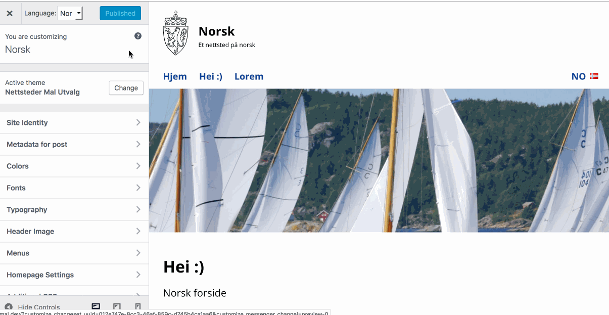

# Add Polylang to WordPress Customizer

## (February 2019) Refactored by [Peder Andreas Nielsen](https://github.com/pederan) at [Dekode](https://en.dekode.no/?noredirect=en_US)



This add-in gives you full [Polylang](https://wordpress.org/plugins/polylang/) support in WordPress customizer. By full support I mean that you customize each language site differently.

For backward compatibility I've elected to not use customizer changesets (this time).

## Prerequisite

1. Polylang must be installed and activated.
1. Add languages in Admin->Languages.
1. If you have a static front page:
	1. Create a front page per language.
	1. In Admin->Settings-Reading, per language, select the front page.
1. Expect customizer to use setting type = theme_mod (the customizer default) as in:
```php
$wp_customize->add_setting( 'setting_id', [
	'type' => 'theme_mod', // the default, you don't have to set this
 ] );
```

## Install
1. Clone or download this repository into your child theme root folder
1. In your child theme functions.php add customizer-polylang.php:

    `require_once get_stylesheet_directory() . '/customizer-polylang.php';`

# Credits

I got the idea from the [customizer-export-import](https://github.com/fastlinemedia/customizer-export-import) plugin.

I did this during work hours at the [Norwegian Government Security and Service Organisation](https://dss.dep.no/english) (DSS). We at DSS believe in sharing code.

# Copyright and License

customizer-polylang.php and js/customizer-polylang.js is copyright 2017 Per Soderlind

customizer-polylang.php and js/customizer-polylang.js is free software: you can redistribute it and/or modify it under the terms of the GNU General Public License as published by the Free Software Foundation, either version 2 of the License, or (at your option) any later version.

customizer-polylang.php and js/customizer-polylang.js is distributed in the hope that it will be useful, but WITHOUT ANY WARRANTY; without even the implied warranty of MERCHANTABILITY or FITNESS FOR A PARTICULAR PURPOSE. See the GNU General Public License for more details.

You should have received a copy of the GNU Lesser General Public License along with the Extension. If not, see http://www.gnu.org/licenses/.
